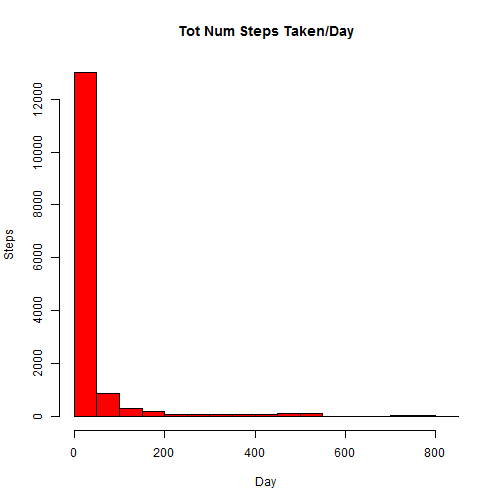
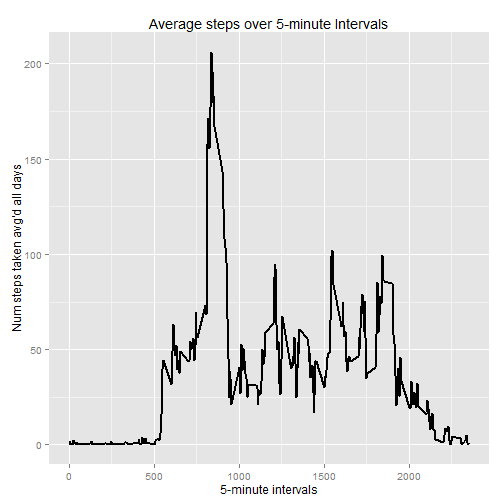
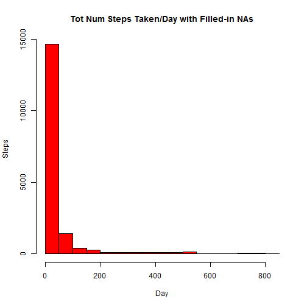
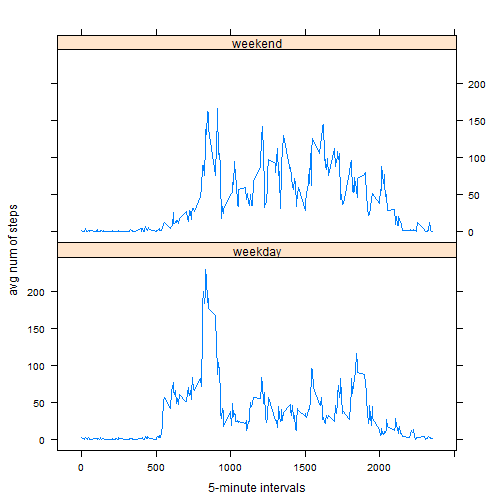

  
Use echo = TRUE so peers can read the code  

```r
echo = TRUE
```

###Loading and preprocessing the data

```r
library(ggplot2)
#for very last panel plot - see README in github
library(lattice)
library(plyr)
data <- read.csv("activity.csv")
#clean data to remove NAs
data2 <- na.omit(data)
```

###What is mean total number of steps taken per day?
For this part of the assignment, you can ignore the missing values in the dataset.

1. Make a histogram of the total number of steps taken each day

```r
#simple histogram
hist(data2$steps, main = "Tot Num Steps Taken/Day", xlab = "Day", ylab = "Steps", col = "Red")
```

 

2. Calculate and report the mean and median total number of steps taken per day.

```r
totsteps <- aggregate(data2$steps, list(date = data2$date), FUN = "sum")$x
#mean
mean(totsteps)
```

```
## [1] 10766.19
```

```r
#median
median(totsteps)
```

```
## [1] 10765
```

###What is the average daily activity pattern?
1. Make a time series plot (i.e. type = "1") of the 5-minute interval (x-axis) and the average number of steps taken, averaged across all days (y-axis)

```r
avgsteps <- aggregate(data2$steps, list(interval = as.numeric(as.character(data2$interval))), FUN = "mean")
#name the second column with a fitting description
names(avgsteps)[2] <- "avgsteps"

#time series plot
#plot(data2$avgsteps~data2$interval, type = "1", ylab = "Num steps taken avg'd all days", xlab = "5-minute interval")
ggplot(avgsteps, aes(interval, avgsteps)) + geom_line(size = 0.8) + labs(title = "Average steps over 5-minute Intervals", x = "5-minute intervals", y = "Num steps taken avg'd all days")
```

 

2. Which 5-minute interval, on average across all the days in the dataset, contains the maximum number of steps?

```r
avgsteps[avgsteps$avgsteps == max(avgsteps$avgsteps), ]
```

```
##     interval avgsteps
## 104      835 206.1698
```

###Input missing values
Note that there are a number of days/intervals where there are missing values (coded as NA). The presence of missing days may introduce bias into some calculations or summaries of the data.

Calculate and report the total number of missing values in the dataset (i.e. the total number of rows with NAs)

```r
#calculate total number of NAs in data
sum(is.na(data))
```

```
## [1] 2304
```

Devise a strategy for filling in all of the missing values in the dataset. The strategy does not need to be sophisticated. For example, you could use the mean/median for that day, or the mean for that 5-minute interval, etc.

Create a new dataset that is equal to the original dataset but with the missing data filled in.

```r
#fill in the NAs with the 5-minute interval mean since we already calculated a part of it earlier
#remember to use original dataset with NAs included
#load original dataset into a third dataset to manipulate
data3 <- data
#for i in the number of rows in our new dataset...
for (i in 1:nrow(data3)) {
    #if there is an NA in the steps column of our new dataset...
    if (is.na(data3$steps[i])) {
        #take the avg steps of the interval and set it to the steps in new dataset
        data3$steps[i] <- avgsteps[which(data3$interval[i] == avgsteps$interval), ]$avgsteps
    }
}
```

Make a histogram of the total number of steps taken each day and Calculate and report the mean and median total number of steps taken per day. Do these values differ from the estimates from the first part of the assignment? What is the impact of inputing missing data on the estimates of the total daily number of steps?

```r
#histogram of new dataset
hist(data3$steps, main = "Tot Num Steps Taken/Day with Filled-in NAs", xlab = "Day", ylab = "Steps", col = "Red")
```

 

```r
totsteps2 <- aggregate(data3$steps, list(date = data3$date), FUN = "sum")$x
#mean
mean(totsteps2)
```

```
## [1] 10766.19
```

```r
#median
median(totsteps2)
```

```
## [1] 10766.19
```
The result naturally shows an uptick in the number of steps taken in the beginning of the histogram but the rest of the plot appears quite similar to when the NAs were removed and not filled-in with other data.

After comparing the old mean and median with the new mean and median, it appears there has been no change to the mean while the median shows a slight different of about 1 step.

The impact is that the total number of steps increases, but the other attributes do not.

###Are there differences in activity patterns between weekdays and weekends?
For this part the weekdays() function may be of some help here. Use the dataset with the filled-in missing values for this part.

Create a new factor variable in the dataset with two levels - "weekday" and "weekend" indicating whether a given date is a weekday or weekend day.

```r
data3$weekdays <- weekdays(as.Date(data3$date))
data3$weekdays[data3$weekdays == "Monday"] = "weekday"
data3$weekdays[data3$weekdays == "Tuesday"] = "weekday"
data3$weekdays[data3$weekdays == "Wednesday"] = "weekday"
data3$weekdays[data3$weekdays == "Thursday"] = "weekday"
data3$weekdays[data3$weekdays == "Friday"] = "weekday"
data3$weekdays[data3$weekdays == "Saturday"] = "weekend"
data3$weekdays[data3$weekdays == "Sunday"] = "weekend"
```

Make a panel plot containing a time series plot (i.e. type = "l") of the 5-minute interval (x-axis) and the average number of steps taken, averaged across all weekday days or weekend days (y-axis). See the README file in the GitHub repository to see an example of what this plot should look like using simulated data.

```r
avgsteps <- ddply(data3, c("interval", "weekdays"), function(x) apply(x[1], 2, 
    mean))

xyplot(avgsteps$steps ~ avgsteps$interval | avgsteps$weekdays, type = "l", 
    ylab = "avg num of steps", xlab = "5-minute intervals", layout = c(1, 2))
```

 

